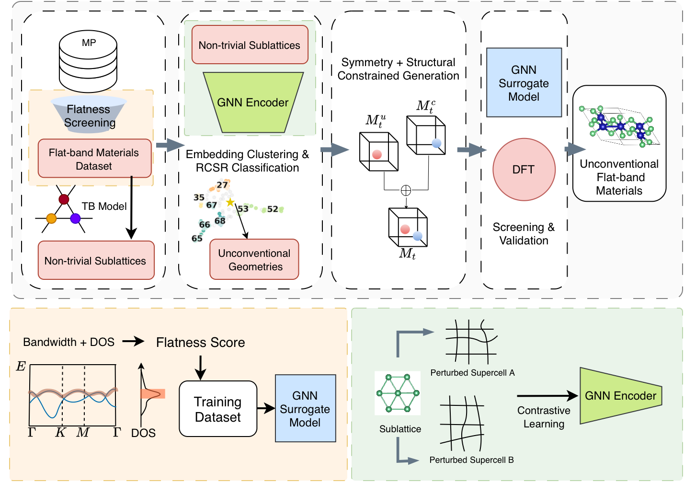

# FlatGen

Code for the paper **"Symmetry-aware generative design of flat-band materials beyond known crystal-net prototypes"** (Wei et al., University of Manchester).

FlatGen is an end-to-end pipeline that discovers flat-band crystal geometries *beyond* the named motif catalogue (Kagome, Lieb, pyrochlore, ...) and transfers them into new chemistries. It mines tight-binding-validated flat-band sublattices ("skeletons") from the Materials Project, embeds them in a continuous geometric latent space to identify high-novelty geometries, and uses these unconventional skeletons as symmetry-compatible constraints for diffusion-based crystal generation (**SkeleGen**). Generated candidates are prescreened for stability and band flatness, then validated with high-throughput DFT.


## Pipeline overview



## Repository layout

| Folder | Pipeline stage | Description |
|---|---|---|
| [`flat_screen/`](flat_screen/) | 1, 5 | Flatness-score labeling from Materials Project bands/DOS and the PyTorch Geometric flatness surrogate model (training + CIF inference) used both for the initial screen and for prescreening generated candidates. |
| [`crystal_net/`](crystal_net/) | 2 | Element-resolved sublattice extraction, nearest-neighbour tight-binding models (pythtb) to validate connectivity-driven flat bands, and crystal-net classification with Systre/RCSR + graph invariants. |
| [`cluster/`](cluster/) | 3 | Self-supervised (contrastive) GNN encoder for sublattice geometry, UMAP + HDBSCAN clustering of the latent space, and novelty scoring to select unconventional skeletons. |
| [`SkeleGen/`](SkeleGen/) | 4–5 | SkeleGen constrained generation: Wyckoff-constraint construction (pyxtal + DP sampler), DiffCSP++ diffusion with the SCIGEN masking strategy, and the screening funnel (SMACT, occupation ratio, e3nn stability classifiers, flatness surrogate). Includes pretrained checkpoints and precomputed constraint data. |

Each folder is a self-contained module with its **own README, conda environment, and configuration** — see the per-module READMEs for setup and run instructions:

- [`flat_screen/README.md`](flat_screen/README.md)
- [`crystal_net/README.md`](crystal_net/README.md)
- [`cluster/README.md`](cluster/README.md)
- [`SkeleGen/README.md`](SkeleGen/README.md)

## Quick start

Each stage runs in its own conda environment:

```bash
# Stage 1 — flatness screening / surrogate model
conda env create -f flat_screen/environment.yml      # env: flat_screen
python flat_screen/model/train_pyg.py                # train surrogate
python flat_screen/model/predict_cif.py              # score external CIFs

# Stage 2 — tight-binding skeleton mining (requires Java for Systre)
conda env create -f crystal_net/environment.yml      # env: crynet
python crystal_net/main.py                           # TB flat-band search
bash crystal_net/submit_screening.sh                 # aggregate + classify nets

# Stage 3 — GNN encoder, clustering, novelty scoring
conda env create -f cluster/environment.yml          # env: cluster
python cluster/run_pipeline.py                       # sublattices → graphs → training
python cluster/cluster_screen.py                     # UMAP + HDBSCAN + novelty scores

# Stages 4–5 — constrained generation + screening
conda env create -f SkeleGen/skelegen/environment.yml   # env: skelegen
cd SkeleGen/skelegen/wysc
python gen_screen.py                                 # full generation + screening
# quick smoke test:
NUM_BATCHES=10 python gen_screen.py
```

Stages 1–3 require a [Materials Project API key](https://materialsproject.org/api) (set in each module's config; see the module READMEs).

Stage 6 (DFT validation) uses VASP through [atomate2](https://github.com/materialsproject/atomate2) `BandStructureMaker` workflows; the computational settings (PBEsol, PAW PBE_54, LDA+U for 3d metals, k-point densities) are detailed in the Methods section of the paper.

## Data flow between modules

- `flat_screen` produces the trained flatness surrogate (`flat_screen/results/flatness_pyg/best_model.pth`), which the `SkeleGen` screening funnel loads directly from that location. The ~500 MB weight file is not included in this repository — train it with `flat_screen/model/train_pyg.py` or download it from the release assets and place it there.
- `crystal_net` produces the validated flat-band sublattice lists and their Systre/RCSR classifications, which feed `cluster`.
- `cluster` produces the latent embeddings, cluster assignments, and novelty scores that define the 236 high-novelty skeletons used as generation constraints in `SkeleGen` (precomputed constraint data ships in `SkeleGen/skelegen/data/`).
- `SkeleGen` outputs screened candidate CIFs ready for DFT validation.

## Key dependencies

PyTorch + PyTorch Geometric (surrogate, encoder), PyTorch Lightning + e3nn + hydra (generation/screening), pythtb (tight-binding), pymatgen / pyxtal / smact / ase / mp-api (materials handling), umap-learn + hdbscan (clustering), Systre (Java, crystal-net classification). Exact pinned versions are in each module's `environment.yml` / `requirements.txt`.

## Acknowledgements

SkeleGen builds on two open-source projects, included here with their licenses:

- **DiffCSP++** (Jiao et al., *Space group constrained crystal generation*, ICLR 2024) — symmetry-aware diffusion backbone (`SkeleGen/skelegen/diffcsp/`, MIT license).
- **SCIGEN** (Okabe et al., *Structural constraint integration in a generative model for the discovery of quantum materials*, Nature Materials 2025) — structural masking strategy and material utilities (`SkeleGen/SCIGEN/`).

The flatness score and surrogate follow Wang et al., *Structure-Informed Learning of Flat Band 2D Materials* ([arXiv:2506.07518](https://arxiv.org/abs/2506.07518)). Sublattice abstraction follows Neves et al., *Crystal net catalog of model flat band materials*, npj Comput. Mater. 10, 39 (2024).

## License

This project is released under the [MIT License](LICENSE). Bundled third-party code retains its original MIT licenses: DiffCSP++ (`SkeleGen/skelegen/LICENSE`) and SCIGEN utilities (`SkeleGen/SCIGEN/LICENSE`).

## Citation

If you use this code, please cite:

```bibtex
@article{wei2026flatgen,
  title   = {Symmetry-aware generative design of flat-band materials beyond known crystal-net prototypes},
  author  = {Wei, Yihao and Savochkin, Ivan and Mishchenko, Artem and Wang, Xiangwen and Yang, Qian},
  year    = {2026}
}
```
